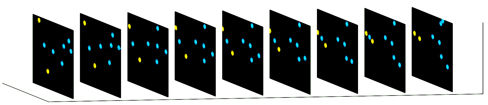
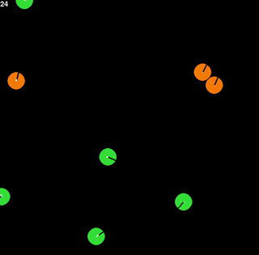
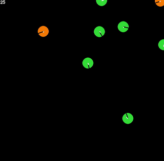
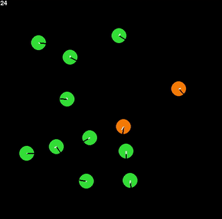
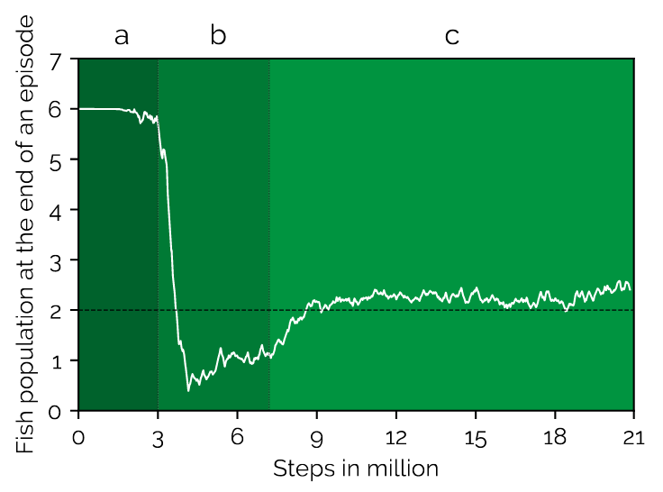
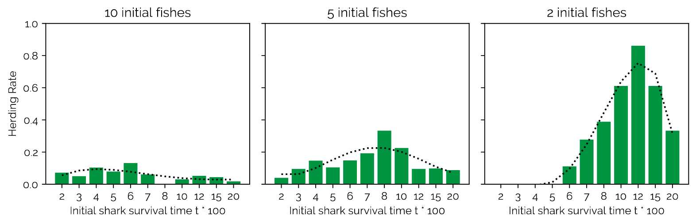
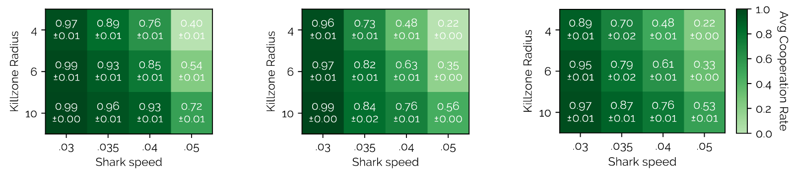
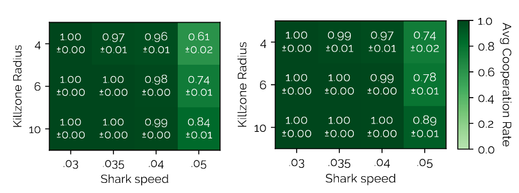

<p float="left">



  <p align="center">
  From left to right: 3 predators cooperating, 2 predators cooperating, 2 predators keeping a herd of prey
  </p>
</p>

Multi-agent reinforcement learning on predator-prey aquarium environment - can sharks learn to cooperate? Or is the tragedy of the commons unavoidable?

Greedy agents in sustainable ecosystems need to refrain from over-exploitation. But are they even able to learn just from environmental influences (i.e. the response of the environment to over-exploitation) and not through reward shaping?

The environment this is analysed with contains a set of sharks as predators and fishes as prey. Sharks are controlled by a continuos set of actions that control speed and angle. Killing a fish gives a reward of 10. The observation only contains the nearest few fishes/sharks. Thus, this is a POMDP.

Previous work analyses a single-agent scenario using a DQN. We find that PPO performs much better, which enables emergent behavior such as cooperation or herding. We end up adding multiple features to the environment (multiple predators, starvation, stunning, no walls, varying difficulty of hunting in terms of view distance and maximum speed).

See the results section further below for a set of charts and results.


## Project Structure

|File/Folder|Purpose|
|----|-------|
|contrib/|Helper bash files for the compute pool.|
|env/|Contains the aquarium environment with an API in accordance to OpenAI gym.|
|evaluators/|Evaluator scripts for each figure.|
|guide/|Contains a small guide to the environment.|
|models/|Trained models are saved here.|
|pickles/|Data created by evaluators.|
|plots/|Plots for the collected data.|
|profiles/|cProfile files used when I sped up the pipeline by using Cython.|
|runs/|Contains runs (for watching in Tensorboard).|
|build.sh|Builds the Cython project.|
|config.pyx|Handles simulations.json. Can be executed directly to get all keys in simulations.json.|
|custom\_logger.pyx|Logging KPIs to Tensorboard.|
|main.py|Entry point.|
|network\_models.py|MLP (norm/batchnorm) neural network models for baselines PPO.|
|pipeline.py|End to end training and evaluation of experiments from simulations.json. The meat of the project.|
|run\_profile.py|For running cProfile.|
|show\_profile.py|For showing cProfile results.|
|shark\_baselines.py|Contains code to run deterministic shark algorithm.|
|simulations.json|All experiments and configurations.|

Note. This is a Cython project, which is why there are `.pyx` files everywhere.
They still work with normal Python when executed directly (e.g. `python3 config.pyx`), because I didn't go deep into cythonization due to time constraints.
It was simply a basically free 40% performance boost.

## Installation and building

1. Install all packages in `requirements.txt`: `pip3 install -r requirements.txt`
2. Run `build.sh`. This requires `g++`!

## Running

1. Create a new experiment in simulations.json or re-use one. For instance, you could pick `ma9_i5_p150_r10_s05_sp200_two_net_vd35_f`.
2. Run: `python3 main.py ma9_i5_p150_r10_s05_sp200_two_net_vd35_f single`

Models are saved in `models/` and runs (for checking them in Tensorboard, e.g. `tensorboard --logdir runs`) are saved in `runs/`.

To load and watch a model, run for example: `python3 main.py ma8_obs load models/ma8_obs-chamb.cip.ifi.lmu.de-20.12.29-20:02:12-83775101-model-F`
You can change the cfg\_id to run the model in (ma8\_obs) and you can change the model to run.

## Results

Accompanying blog post can be found [here](https://blog.xa0.de/post/Emergent-Behaviour-in-Multi-Agent-Reinforcement-Learning%20---%20Independent-PPO/).
The paper in a short summary:

1. We find emergent herding. PPO learning is in three stages: First stage where sharks are not able to catch fish effectively yet, second stage where they are extremely good at it and destroy the population, third stage where they learn to restrain themselves and thus become sustainable.

<p align="center">

</p>

2. We find that herding emerges much more in certain scenarios --- certain starving pressure and few starting fishes (thus inducing a sustainability scenario). Figure below shows from left to right the scenarios 10, 5 and 2 initial fishes.

<p align="center">

</p>

3. We find that cooperation also emerges, due to environmental influences --- number of initial fishes (from left to right in figure below), maximum shark speed (lower increases hunting difficulty), kill zone radius and view distance.

<p align="center">

</p>

<p align="center">

</p>

For more details check out the paper! TODO: Link it here.

[Here](https://www.youtube.com/user/oORnetworkOo/videos) you can find a few videos of some of the emergent behavior.

## Citing

To cite this repository in publications:

```
@misc{RRP+21,
  author = {Ratke, Daniel and Ritz, Fabian and Phan, Thomy and Belzner, Lenz and Linnhoff-Popien, Claudia},
  title = {fish-rl-alife},
  year = {2021},
  publisher = {GitHub},
  journal = {GitHub repository},
  howpublished = {\url{https://github.com/instance01/fish-rl-alife}},
}
```

<p align="center">

</p>
