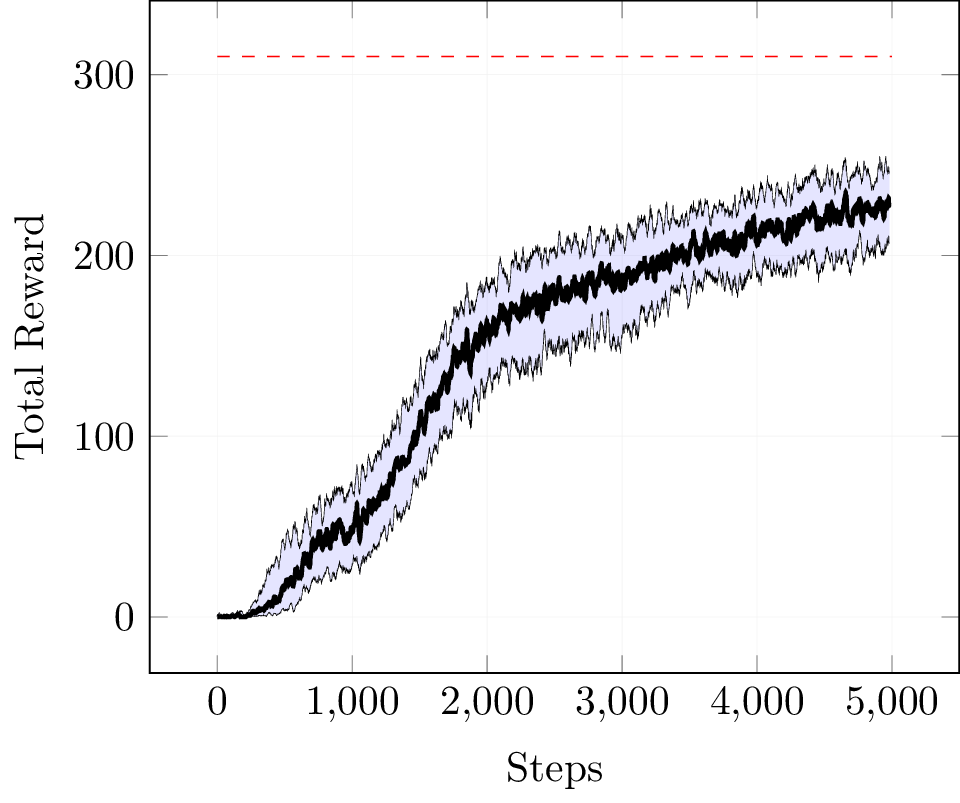
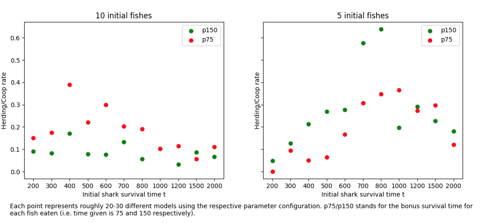

MARL on Aquarium environment --- can sharks learn to cooperate? Or is the tragedy of the commons unavoidable?

Using PPO.

## Debugging

python3 -m pdb -c continue main.py

## Results

Best so far: 13\_3 and ma3 (20-11-27\_07:56:47-99-inn.cip.ifi.lmu.de-ma3)

Of course ma3 had the sharks not die. So they cooperated because they can't die and cooperating increases reward.

