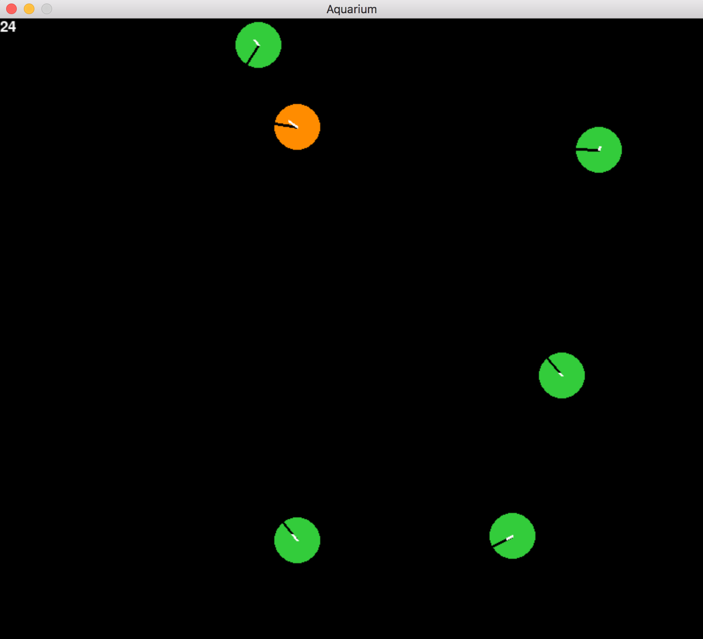

## Introduction

The scope of this document is fluid. For now, this is a quick guide on the
aquarium environment to get students up and running in a small amount of time.
Later, short summaries of the research conducted using this environment may be
added.
The following section shortly describes the premise of the environment and
important details such as the observation space and the action space.
Authors of the environment include Carsten Hahn, Fabian Ritz and Thomy Phan.

## The Environment

The main purpose of the aquarium environment is to simulate an aquarium full of
a variable amount of fishes and sharks. Movement is relatively realistic and
may be based on realistic rules such as the Boids framework.
Before the simulation starts, the number of fishes including their respective
strategies and the number of sharks is defined. There are a multitude of
further settings such as the number of walls or fishes that can be observed.
Even the behavior of the walls themselves may be adapted, for instance to
define the world as a torus.
A major architectural point of the environment is exchangeability - there is
a base animal class from which both fishes and sharks inherit, and each fish
may have a different strategy. Same can be said about the sharks.

*The aquarium. Orange circle is a shark, green circles are fishes.*

The Figure above shows an examplary simulation.

Different research projects train different components of the environment. This
guide will focus on training the shark, however there have been publications
that trained the fishes (Hahn et al., 2019). The publication referred to here also
adapted the action space to only allow each animal to turn their angle. Thus,
while the action space below will be explained in its complete state, but
depending on the project some elements could be simplified.

### Action Space

The environment expects a `joint_shark_action`, i.e. a dictionary where
sharks are the keys and the action itself is the value. The action consists of
three values: speed, angle and whether to procreate.

### Observation Space

The observation returned is structured as a dictionary with each shark as the
key and its respective observation as the value. Now, the observation includes
a few status informations about the shark itself but also the animals it sees.
For scalability, only a subset of animals can be observed, making the
environment a partially observable one. Specifically, the orientation (scaled
from radians to the range `[-1, 1]`) and the readiness to procreate are
included as status information. Next, distance and angle to each wall that is
in the view distance of the current shark is added. Since there are 4 walls,
this results in 8 values. If walls are disabled (i.e. a torus is used), the 8
values are replaced by zeroes. One of the main principles of the environment is
a consistent observation space, which is achieved by this sort of zero-padding.
Next, `n` 3-tuple slots are used for sharks that may or may not be visible. `n`
is a hyperparameter that is set beforehand and stays constant throughout
training and evaluation. One 3-tuple slot consists of the distance to the other
shark, the angle to the shark and the orientation of the other shark. Sharks
that are outside of the visible range lead to zero-padding. After this, `m`
slots of the same structure are available for the fishes.

### Reward

The environment returns a dictionary with sharks as keys and the reward
attained by the respective shark. The reward of a shark increases by `+10` when
it eats a fish.

### Step

After a step in the environment, the standard 3-tuple known for gym
environments is returned. However, all three elements of that tuple are
dictionaries with sharks as keys and the observation, reward and done flag for
the respective shark as the value.

### Further Settings

TODO: Radius

## References

Emergent escape-based flocking behavior using multi-agent reinforcement learning, Hahn et al., 2019.
